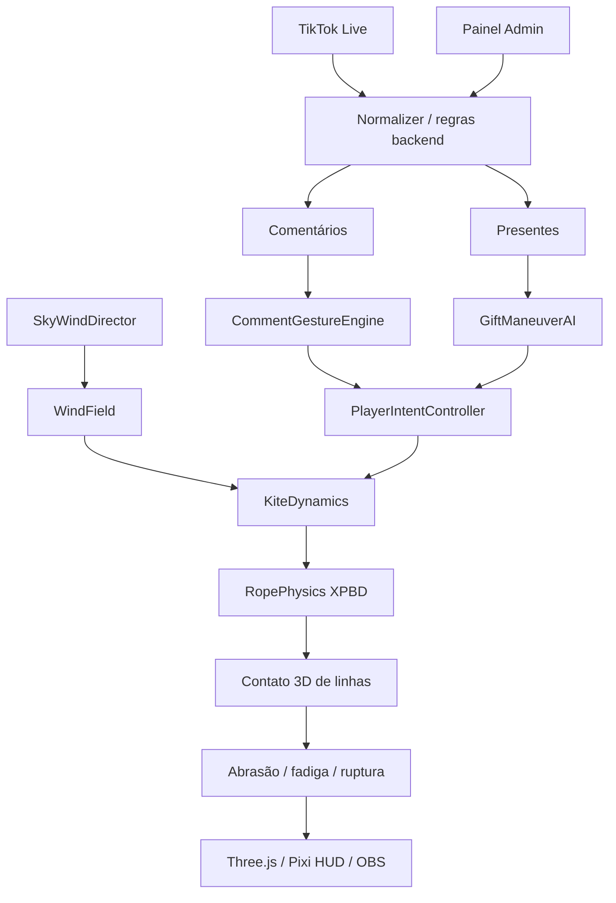
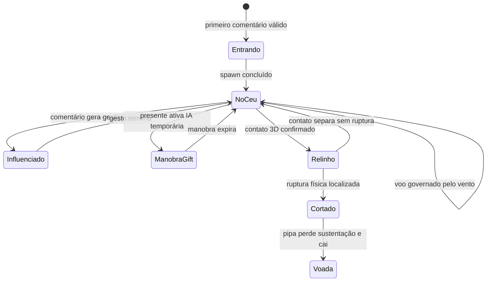

# 01. Arquitetura e conceito do jogo

**Atualizado em 02/10/2026 para a arquitetura híbrida vigente.**

## Visão do produto

`Competição de Pipa TikTok Live` é uma arena vertical 3D para transmissão ao vivo. Até 40 participantes podem manter pipas simultaneamente no céu. O combate normal é automático e emerge do vento; não existe caça automática a jogadores específicos.

A arquitetura combina três responsabilidades:

1. **comportamento de live 2D:** céu sempre ativo, muitas pipas e cruzamentos frequentes;
2. **mecânica de pipa 3D:** atitude, vento aparente, spool, tensão, folga, inércia e corda determinam o movimento;
3. **física experimental de linha:** somente contato geométrico 3D verdadeiro pode gerar relinho, abrasão, fadiga e corte.

Regra central:

> **Vento cria o PvP. Comentário influencia. Presente pilota. Física decide.**

## Arquitetura de alto nível

## Componentes principais

### Backend
- `tiktokService.js`: conexão/reconexão e recebimento de eventos TikTok.
- `tiktokEventNormalizer.js`: identidade, comentário, gift, repeat count, foto e metadados normalizados.
- `gameRules.js`: entrada/fila/estado canônico da arena.
- `giftCatalog.js` e regras de gift: catálogo e resolução econômica temporária durante a migração.

### Frontend físico
- `WindField`: vetor de vento suave e determinístico.
- `SkyWindDirector` **a implementar**: fases globais do vento e ritmo natural da arena; não escolhe oponentes.
- `PlayerIntentController`: fronteira única para intenções físicas.
- `CommentGestureEngine` **a implementar**: comentário arbitrário -> gesto curto e limitado.
- `GiftManeuverAI` **a implementar**: gift -> sequência inteligente de controles físicos.
- `KiteDynamics`: autoridade de `x/y/z`, velocidade e atitude.
- `SpoolController`: puxar/soltar comprimento real da linha.
- `RopePhysics`: corda XPBD, geometria, folga e tensão.

### Combate de linha
- `LineBroadPhase`: reduz candidatos de contato.
- narrow phase/RopeCollision: confirma proximidade geométrica 3D.
- `LineContactManager`: rastreia contatos sob orçamento fixo.
- `LineAbrasionModel`: atrito/deslizamento/tensão/material -> desgaste.
- `LineStructuralModel`: sobrecarga sustentada -> fadiga estrutural.
- `LineBreakSystem`: ruptura localizada no segmento físico.

### Renderização
Three.js e Pixi/DOM são consumidores do estado da simulação. Renderizador, câmera, partículas, labels e efeitos não podem reescrever coordenadas, HP ou geometria lógica da linha.

## Movimento normal da arena

Sem comentário e sem gift, a pipa continua ativa. O `SkyWindDirector` altera lentamente direção, intensidade, rajadas e turbulência global. Cada pipa responde de forma individual por profundidade, fase e estado físico.

Não há `targetId`, `nearestEnemy`, perseguição automática ou aproximação forçada de pares como regra normal.
## Comentários

O modelo antigo de comandos fixos foi removido da interação pública. `1`, `2`, `3`, `puxar`, `soltar`, `embicar` e equivalentes não são comandos obrigatórios para espectadores.

O fluxo novo é:

`comentário -> validação/anti-spam -> score de engajamento -> CommentGestureEngine -> intenção física curta -> PlayerIntentController`

A intenção pode ajustar `spoolCommand`, `debicoTorque`, `trimPitch`, `tensionAssist`, intensidade e duração. Ela não pode alterar posição/velocidade diretamente nem reduzir HP.

Todos os comentários aceitos também podem alimentar `CrowdEnergy`, um sinal global saturado em `[0,1]` que modula somente parâmetros seguros do céu, como amplitude de rajada e ritmo de transição do vento.

## Presentes

O gift resolve primeiro o valor econômico e o buff/material temporário. Depois o `GiftManeuverAI` pode assumir a pipa por uma janela limitada.

A IA do presente:

- lê vento, atitude, spool/tensão e limites da arena;
- consulta um `LineDensityField` 3D de baixa resolução;
- avalia poucos corredores alcançáveis;
- escolhe uma trajetória que maximize oportunidade de cruzar linhas, sem escolher usuário-alvo;
- emite apenas intenções físicas para `PlayerIntentController`.

Retão, mergulho, laçada e aparada devem emergir da sequência de controles físicos, nunca de uma trajetória X/Y pré-gravada.

## Contato e corte

Um cruzamento visual na câmera não é suficiente. O contato só existe quando os segmentos das duas cordas entram no raio de proximidade em 3D.

`Rope geometry -> BroadPhase -> NarrowPhase 3D -> ContactManager -> Abrasion/Structural -> Break`

Somente esse pipeline pode produzir desgaste/corte. Comentário, presente, câmera e efeitos visuais não possuem autorização para declarar vencedor.
## Ciclo de vida resumido

## Limites permanentes

- até 40 pipas ativas;
- fixed step de 60 Hz;
- `maxTracked <= 12` e `maxSolved <= 3`;
- nenhuma busca todos-contra-todos de todos os segmentos por frame;
- nenhuma consulta de rede/banco dentro do loop físico;
- nenhum renderer escrevendo `kite.z` ou estado de contato;
- nenhum gift/comentário com dano direto;
- materiais são classes virtuais de gameplay, sem receitas reais.

## Documentação de referência

A especificação detalhada vigente é [`superpowers/specs/2026-10-02-hybrid-live-kite-combat-design.md`](superpowers/specs/2026-10-02-hybrid-live-kite-combat-design.md). Documentos anteriores continuam disponíveis como histórico e devem ser interpretados conforme [`README.md`](README.md).
