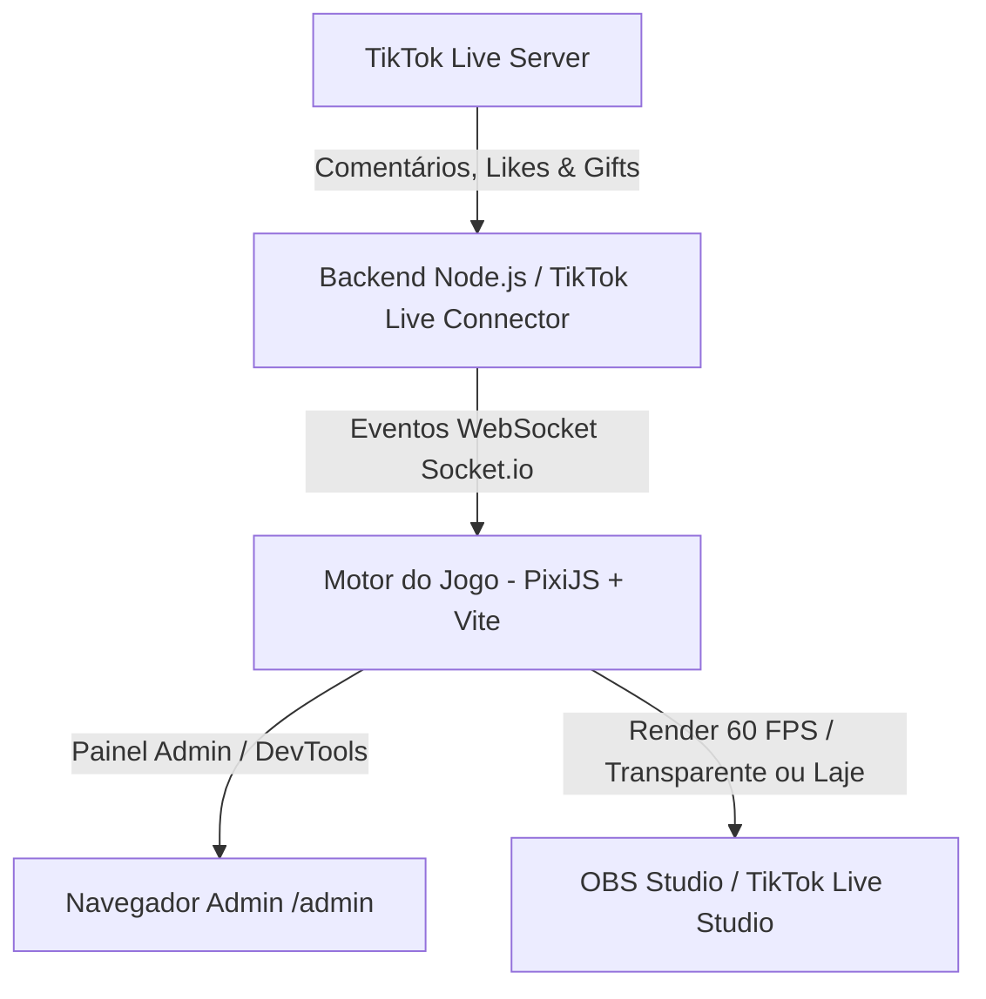
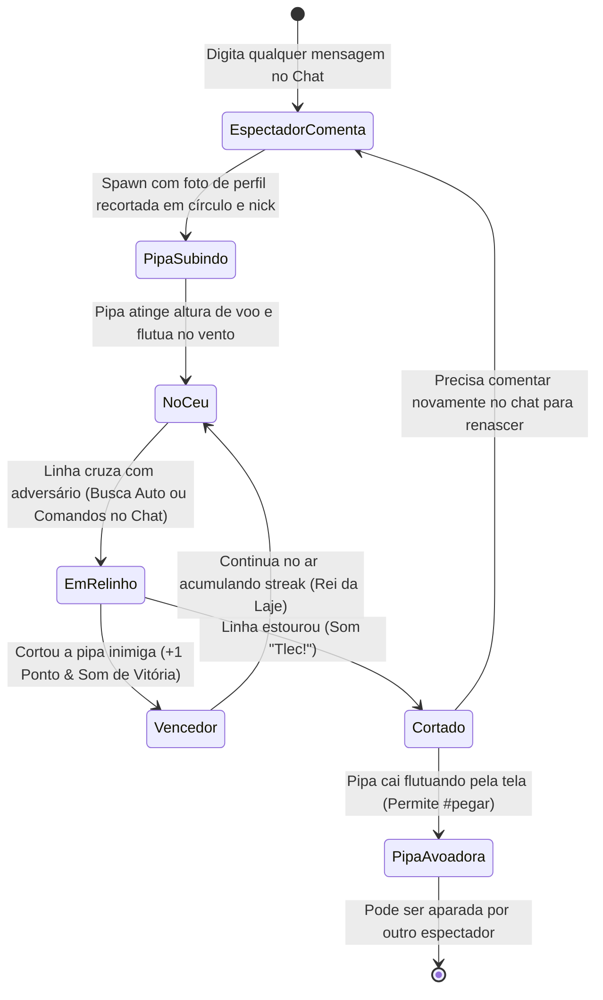

> **Atualização de 24/09/2026:** o modelo vigente é comentário para entrar, vento automático para movimentar e provocar relinhos, e presentes para vantagens. Comandos manuais e captura por `#pegar` descritos abaixo pertencem ao planejamento anterior. Consulte [a regra atual e os efeitos implementados](08_vento_automatico_e_presentes.md). O combate atual utiliza dano contínuo por HP; a regra antiga de corte por diferença de 25% não foi implementada.

# 📐 01. Arquitetura e Conceito do Jogo

## Visão Geral do Sistema

O jogo é um sistema interativo em tempo real para **TikTok Live**, onde espectadores participam enviando mensagens no chat ou presentes (Gifts).



## Componentes da Arquitetura
1. **Backend Integrador**: Node.js com `tiktok-live-connector`, Express e `Socket.io` na porta 3000.
2. **Painel de Simulação (DevTools)**: Rota `/admin` em `http://localhost:3000/admin` para testar comentários, gifts e likes localmente.
3. **Frontend / Motor de Jogo**: PixiJS com Vite (60 FPS para dezenas de pipas simultâneas).
4. **Exibição OBS**: Híbrido alternável entre **Overlay 100% Transparente** ou **Modo Cenário Completo de Favela/Laje**.

---

## Contratos de Dados WebSocket (Schema de Eventos)

Todos os eventos emitidos pelo backend para o frontend seguem uma estrutura padronizada:

### `player:spawn`
Disparado quando um espectador comenta pela primeira vez ou após renascer:
```json
{
  "userId": "string",
  "uniqueId": "@usuario_tiktok",
  "nickname": "Nome do Usuário",
  "profilePictureUrl": "https://p16-sign.tiktokcdn.com/...",
  "kiteType": "peixinho | raiada | carrapeta",
  "lineType": "algodao",
  "power": 1.0,
  "shield": 0
}
```

### `player:action`
Disparado quando o jogador envia comandos rápidos de combate:
```json
{
  "userId": "string",
  "action": "puxar | descarregar | embicar",
  "timestamp": 1727190000000
}
```

### `gift:received`
Disparado quando um presente é enviado na Live:
```json
{
  "userId": "string",
  "uniqueId": "@usuario_tiktok",
  "giftId": 5655,
  "giftName": "Rosa | Donut | Capivara | Perfume | Leao",
  "diamondCount": 1,
  "upgrade": {
    "lineType": "cerol | chile | kevlar",
    "powerMultiplier": 1.5,
    "durationSeconds": 60,
    "specialAbility": "tornado | mestre_do_ceu | null"
  }
}
```

### `likes:burst`
Disparado quando há curtidas em massa:
```json
{
  "totalLikes": 50,
  "speedBonusPercent": 25,
  "durationSeconds": 30
}
```

### `catch:attempt`
Disparado quando alguém tenta aparar uma pipa avoadora:
```json
{
  "catcherUserId": "string",
  "catcherNick": "Nome do Resgatador",
  "targetKiteId": "string"
}
```

---

## Ciclo de Vida do Jogador


