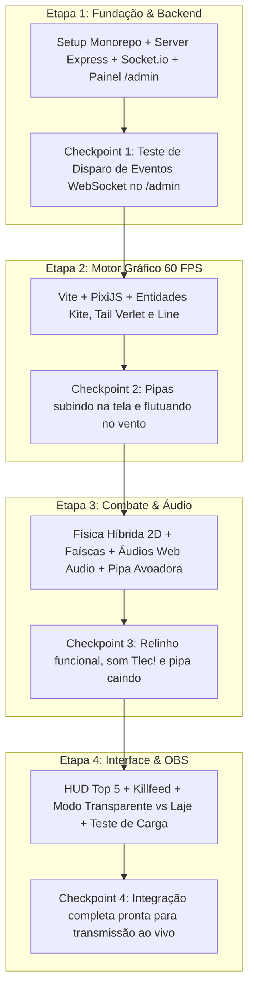

> **STATUS: HISTÓRICO / CHECKPOINT.** Este arquivo registra uma etapa real do desenvolvimento, mas não define sozinho a regra vigente. Em caso de conflito sobre vento, comentários, alvos, presentes, manobras, contato ou corte, prevalecem `00_arquitetura_vigente.md` e `superpowers/specs/2026-10-02-hybrid-live-kite-combat-design.md`.

# 📅 04. Etapas Sequenciais de Implementação

## Cronograma de Desenvolvimento e Checkpoints (4 Etapas)

## Matriz de Entregáveis por Etapa

| Etapa | Foco Principal | Arquivos Criados / Modificados | Critério de Conclusão (DoD) |
|---|---|---|---|
| **Etapa 1** | Backend & Admin | `package.json` `backend/server.js` `backend/tiktokService.js` `backend/views/admin.html` `backend/rules/*` | Servidor roda na porta 3000, rota `/admin` dispara eventos WebSocket validados no log |
| **Etapa 2** | Render PixiJS | `frontend/vite.config.js` `frontend/index.html` `frontend/src/main.js` `frontend/src/engine/App.js` `frontend/src/entities/Kite.js` `frontend/src/entities/Tail.js` `frontend/src/entities/Line.js` | Botão "Spawn Pipa" no `/admin` faz surgir pipa com avatar e rabiola na tela a 60 FPS |
| **Etapa 3** | Relinho & Áudio | `frontend/src/engine/Physics.js` `frontend/src/engine/AudioManager.js` `frontend/src/entities/SparkEmitter.js` `frontend/src/entities/FallingKite.js` | Duas pipas cruzando linhas emitem faíscas, som "Tlec!" e a perdedora desce rodopiando |
| **Etapa 4** | HUD & OBS | `frontend/src/ui/HUD.js` `frontend/src/ui/SkyScene.js` `frontend/src/managers/KiteStatusManager.js` | Placar Top 5 animado, killfeed na tela, suporte a fundo transparente no OBS e teste com 30+ pipas |
