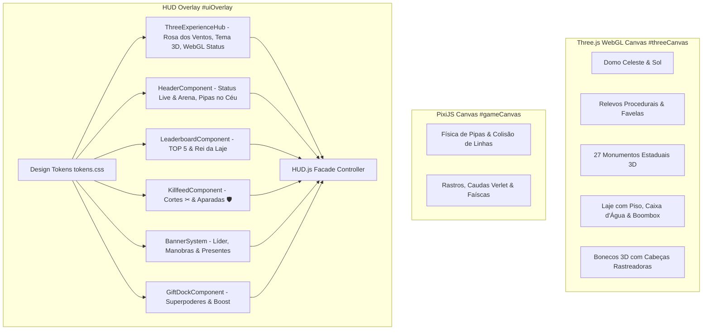

> **ARQUIVADO / HISTÓRICO.** Este documento registra uma etapa anterior e não define a regra vigente. Consulte [`docs/README.md`](../../README.md) e [`00_arquitetura_vigente.md`](../../00_arquitetura_vigente.md).

# 61. Arquitetura de UI/UX, Design System e Experiência 3D

**Data:** 30/09/2026  
**Status:** Implementado e 100% Validado  
**Diretrizes Aplicadas:** `/3d-web-experience`, `/ui-ux-pro-max`, `/frontend-design`, `/mobile-design`, `/canvas-design`  
**Escopo:** Transmissão Vertical TikTok Live (1440 × 2560 e 1080 × 1920) e OBS Studio

---

## 1. Visão Geral da Arquitetura

Para acompanhar a refatoração modular da cena 3D (`ThreeSkyScene.js`) e elevar o acabamento visual do jogo para um padrão de excelência profissional, foi estabelecida e implementada a **Arquitetura "Kinetic 3D HUD & Design Tokens"**.

A arquitetura desacopla a camada de apresentação em 3 planos espaciais estritos:

---

## 2. Design Tokens Architecture (`tokens.css`)

Criado o arquivo canônico [frontend/src/ui/design/tokens.css](../../../frontend/src/ui/design/tokens.css), importado nativamente no `game.css` e linkado em `index.html`.

### 2.1 Hierarquia Espacial & Z-Index
- `--z-3d-canvas: 0`: Three.js WebGL (Sol, nuvens, morros, monumento e laje 3D).
- `--z-physics-canvas: 1`: PixiJS 2D (Renderização de física, linhas e colisões).
- `--z-ui-base: 10`: Contêiner de overlay e grid de HUD.
- `--z-ui-panels: 20`: Header, Leaderboard TOP 5, Dock de presentes.
- `--z-ui-toasts: 30`: Banners de novo líder, toasts de manobras e killfeed.
- `--z-ui-modals: 40`: Celebrações de presentes lendários e alertas críticos.

### 2.2 Zonas Seguras (Safe Zones) para TikTok Live 9:16
- `--safe-top: clamp(16px, 2.5vh, 48px)`: Garante respiro superior para status de conexão e telemetria.
- `--safe-right: clamp(18px, 4vw, 56px)`: **Margem crítica de proteção**. Impede que elementos da HUD entrem em conflito com botões nativos do TikTok (Seguir, Curtir, Compartilhar).
- `--safe-bottom: clamp(16px, 3vh, 52px)`: Eleva o dock de presentes e a laje dos bonecos acima do fluxo ininterrupto de comentários do chat ao vivo.
- `--combat-zone-top: 10%` e `--combat-zone-bottom: 75%`: **Área protegida de voo**, onde nenhum modal invasivo pode ser fixado, garantindo visibilidade total dos combates de pipas.

### 2.3 Superfícies & Glassmorphism
- `--surface-glass-ultra: rgba(6, 19, 29, 0.78)` com `backdrop-filter: blur(12px)`
- Bordas táticas com sutis reflexos dourados (`--border-glow-gold`), cianos (`--border-glow-cyan`) e carmesins (`--border-glow-rose`).

---

## 3. Componentes Modulares da UI (`frontend/src/ui/components/`)

### 3.1 `ThreeExperienceHub.js` & Controles da Experiência 3D (/3d-web-experience)
Conecta a cena 3D diretamente à telemetria e controle do streamer:
1. **Rosa dos Ventos 3D (Bússola Vetorial)**:
   - Sincroniza em tempo real com `Wind.sample()` e a translação das nuvens no domo do Three.js.
   - Agulha direcional com rotação trigonométrica (`Math.atan2(wy, wx)`) e velocidade calculada em km/h (Suave, Moderado, Forte).
2. **Chip do Tema 3D & Monumento Estadual Ativo (27 Estados)**:
   - Exibe em tempo real o estado e monumento ativo (ex: 📍 RIO DE JANEIRO · Cristo Redentor, SÃO PAULO · Ponte Estaiada, etc.).
   - Clique direto no chip ou tecla de atalho **`M`** (e botão `btnCycleTheme`) alterna instantaneamente entre os 27 cenários estaduais da federação.
3. **Controle de Câmera 3D (`setCameraMode` / `cycleCameraMode`)**:
   - Alternância com tecla de atalho **`C`** e botão de HUD `btnCameraMode` entre:
     - `normal`: Visão frontal padrão de combate (Z = 720).
     - `cinematic`: Ângulo baixo heróico com foco nas pipas e sol (Z = 590, Y = -60).
     - `panoramic`: Visão aérea contemplativa do skyline, laje e relevo 3D (Z = 840, Y = 190).
4. **Monitor de Status WebGL & Fallback Graceful**:
   - Atende à exigência estrita do skill `/3d-web-experience` de validação de suporte a WebGL e fallbacks em hardware com aceleração desativada.
5. **Microinteração Áudio-Reativa**:
   - Pulso luminoso estético disparado em sincronia com batidas sonoras do boombox da laje (`pipa:boombox_beat`).

### 3.2 `HeaderComponent.js`
- Tipografia com gradiente e badge de live.
- Indicador bidirecional de integridade da Live (`connectionStatus` e `tiktokLiveStatus`), reconhecendo reconexões de transporte (`transport_restored`) e localização de sala (`room_found`).
- Contagem dinâmica de participantes e pipas no céu (`kiteCounter`, `queueCounter`).
- Broadcast controls integrados (`btnSound`, `btnVoice`, `btnToggleScene`).

### 3.3 `LeaderboardComponent.js`
- TOP 5 da Live com pódio dourado, prateado e bronze.
- Destaque animado `rank-up` quando um participante sobe de posição.
- Hall da Fama estruturado: Maior Sequência (`streak`), Reis Derrubados (`kingCuts`) e Mais Presentes (`gifts`).
- Card de status da coroa ativa (`activeKing`) com avatar e cortes do Rei da Laje.
- Higienização segura de dados contra XSS (fotos sanitizadas com `no-referrer` e remoção automática em caso de erro).

### 3.4 `KillfeedComponent.js`
- Feed de combate no canto lateral direito (respeitando a safe-zone do TikTok).
- Notificações estilizadas para:
  - Cortes de linha (`✂`, `.feed-cut`)
  - Aparadas com sucesso (`🛡️`, `.feed-parry`)
  - Entrada de novos participantes (`🪁`, `.feed-join`)
  - Presentes enviados (`🎁`, `.feed-gift`)
  - Transições de mapa estadual 3D (`📍`, `.feed-map-change`)
- Limite de 3 itens simultâneos e descarte suave via CSS fade-out.

### 3.5 `BannerSystem.js`
- Pílulas flutuantes horizontais de alta visibilidade com auto-dismiss (2.5s a 3.5s):
  - `leadershipBanner`: Novo Líder da Arena.
  - `competitionNotice`: Alertas de campeonato, marcos de sequência ("TÁ ESQUENTANDO!", "REI DA LAJE!") e queda do rei.
  - `maneuverToast`: Execução de manobras especiais (Retão, Despicada, Perseguição, Aparada, Mergulho Parafuso, Laçada).
  - `giftCelebration`: Fila inteligente de presentes com efeito de pulso e ícone oficial.

### 3.6 `GiftDockComponent.js`
- Barra tátil inferior contendo a legenda de presentes e superpoderes (`🌹 RETÃO`, `🍩 DESPICAR`, `🦫 APARAR`, `🌪️ PERSEGUIR`, `🦁 PROTEÇÃO`).
- Feedback visual com efeito `gift-active` (escala e brilho luminoso) no momento do disparo.
- Banner integrado de Boost de Agilidade (`#boostStatus`).

---

## 4. Facade Pattern no `HUD.js`

O arquivo [frontend/src/ui/HUD.js](../../../frontend/src/ui/HUD.js) foi transformado em uma **Fachada Orquestradora Limpa**:
- Preserva 100% dos métodos e propriedades públicas requeridas por `App.js`, testes unitários e testes end-to-end do OBS.
- Getters e setters transparentes garantem integridade total de estado (`currentLeaderId`, `competitionRankEnabled`, etc.).
- Desacoplamento arquitetural: novos componentes ou recursos de UI podem ser criados e testados isoladamente sem risco de efeitos colaterais nos demais subsistemas.

---

## 5. Validação Técnica & Garantia de Qualidade

1. **Bateria de Testes Automatizados:**
   - **185/185 testes aprovados (100% green)** no `npm test`.
   - Compatibilidade estrita preservada em regexes de integridade de sincronização, dimensionamento vertical e mitigação de memory leaks.
2. **Build de Produção (Vite):**
   - Execução de `npm run build` concluída em 5.75s sem erros.
   - Sincronização entre `frontend/dist` e `frontend/dist-preview`.
3. **Performance (60 FPS Budget):**
   - Translações e animações aceleradas por GPU (`transform: translateZ(0)` e `will-change`).
   - Zero consumo de render loop do Three.js em modo de overlay transparente OBS.
4. **Browser Smoke Test E2E (`tests/browser-smoke.mjs`):**
   - 11/11 etapas aprovadas (`boot`, `40 pipas`, `DOM seguro`, `checkpoint e restauração após reload de teste`, `executor único de combate`, `combo 3x Capivara`, `manobra de aparar`, `likes`, `resize portrait`, `overlay`, `combate sem exceções`).
   - **0 erros no console (`errors: []`)** e exit code 0.
