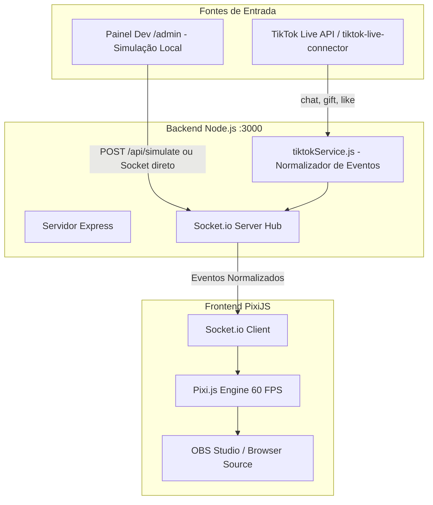

> **ARQUIVADO / HISTÓRICO.** Este documento registra uma etapa anterior e não define a regra vigente. Consulte [`docs/README.md`](../../README.md) e [`00_arquitetura_vigente.md`](../../00_arquitetura_vigente.md).

# 🏗️ Plano de Implementação: Arquitetura Técnica do Sistema

Este plano detalha a fundação arquitetural do projeto, definindo a infraestrutura monorepo, o fluxo de dados em tempo real, os contratos dos eventos WebSocket e a estratégia de simulação/fallback para o TikTok Live.

---

## 1. Descrição do Objetivo
Estabelecer a infraestrutura completa de backend e frontend para suportar a comunicação em tempo real entre os eventos do TikTok Live (ou painel dev) e o motor gráfico PixiJS no OBS Studio com latência mínima (<50ms).



---

## 2. Revisão do Usuário Obrigatória (User Review Required)

> [!IMPORTANT]
> **Modo Híbrido Online/Offline (Zero Dependência de Live Ativa para Desenvolver)**:
> O backend terá um serviço comutável: se for fornecido um `@username` de live do TikTok, ele conecta; caso contrário (ou se a live estiver offline), ele ativa automaticamente o modo de simulação, permitindo que 100% dos recursos sejam testados via `/admin`.

> [!NOTE]
> **Portas e Roteamento Unificado**:
> O servidor Express rodará na porta `3000`:
> - `http://localhost:3000/` -> Interface do jogo (para o OBS).
> - `http://localhost:3000/admin` -> Painel de testes para disparar comentários e presentes fictícios.

---

## 3. Contratos de Dados WebSocket (Schema de Eventos)

Todos os eventos emitidos pelo backend para o frontend seguirão uma estrutura uniforme e tipada:

### `player:spawn`
Disparado quando um espectador comenta pela primeira vez ou após renascer:
```json
{
  "userId": "string",
  "uniqueId": "@usuario_tiktok",
  "nickname": "Nome do Usuário",
  "profilePictureUrl": "https://p16-sign.tiktokcdn.com/...",
  "kiteType": "peixinho | raiada | carrapeta",
  "lineType": "algodao",
  "power": 1.0,
  "shield": 0
}
```

### `player:action`
Disparado quando o jogador envia comandos rápidos de combate:
```json
{
  "userId": "string",
  "action": "puxar | descarregar | embicar",
  "timestamp": 1727190000000
}
```

### `gift:received`
Disparado quando um presente é enviado na Live:
```json
{
  "userId": "string",
  "uniqueId": "@usuario_tiktok",
  "giftId": 5655,
  "giftName": "Rosa | Donut | Capivara | Perfume | Leao",
  "diamondCount": 1,
  "upgrade": {
    "lineType": "cerol | chile | kevlar",
    "powerMultiplier": 1.5,
    "durationSeconds": 60,
    "specialAbility": "tornado | mestre_do_ceu | null"
  }
}
```

### `likes:burst`
Disparado quando há curtidas em massa:
```json
{
  "totalLikes": 50,
  "speedBonusPercent": 25,
  "durationSeconds": 30
}
```

### `catch:attempt`
Disparado quando alguém tenta aparar uma pipa avoadora:
```json
{
  "catcherUserId": "string",
  "catcherNick": "Nome do Resgatador",
  "targetKiteId": "string"
}
```

---

## 4. Alterações Propostas na Estrutura de Código

### Monorepo e Configurações Raiz

#### [NEW] `package.json`
- Definir workspaces ou scripts integrados:
  - `"dev"`: Inicia backend Node.js (`backend/server.js`) e frontend Vite em modo concorrente/proxy.
  - Dependências backend: `express`, `socket.io`, `tiktok-live-connector`, `cors`.
  - Dependências frontend: `vite`, `pixi.js`, `howler`.

---

### Backend (`/backend`)

#### [NEW] `backend/server.js`
- Inicialização do Express e Socket.io na porta `3000`.
- Roteamento estático para `backend/views/admin.html` em `/admin`.
- Servir arquivos do frontend gerados pelo Vite ou redirecionar no modo desenvolvimento.
- Gerenciamento de conexões Socket.io com broadcast de eventos.

#### [NEW] `backend/tiktokService.js`
- Wrapper da classe `WebcastPushConnection` da lib `tiktok-live-connector`.
- Handlers para os eventos:
  - `chat`: filtra se é comando (`puxar`, `descarregar`, `#pegar`) ou comentário normal de entrada (spawn).
  - `gift`: mapeia presentes conhecidos (Rosa, Donut, Capivara, Perfume, Leão) para os upgrades do jogo.
  - `like`: agrupa curtidas e emite `likes:burst`.
- Mecanismo de reconexão resiliente em caso de oscilação de rede.

#### [NEW] `backend/views/admin.html`
- Painel web moderno, escuro e responsivo:
  - Formulário para conectar/desconectar a qualquer `@username` do TikTok.
  - Botão de **Modo Simulação** com botões rápidos:
    - `+ Spawn Pipa Aleatória` (com nomes e avatares fictícios).
    - Botões de presentes: `🌹 Rosa`, `🍩 Donut`, `🦫 Capivara`, `🌪️ Perfume`, `🦁 Leão`.
    - Botões de comandos: `⚡ Puxar`, `🛡️ Descarregar`, `🪝 #pegar`.
  - Console de log ao vivo de todos os pacotes WebSocket emitidos.

---

### Frontend (`/frontend`)

#### [NEW] `frontend/vite.config.js`
- Configuração do Vite para desenvolvimento rápido com Hot Module Replacement (HMR).
- Proxy configurado para a porta 3000 do backend (WebSockets e API).

#### [NEW] `frontend/index.html`
- Ponto de entrada do canvas para o OBS Studio com viewport configurado e fundo transparente por padrão.

#### [NEW] `frontend/src/main.js`
- Inicialização da conexão `io()` (Socket.io client).
- Dispatcher central de eventos recebidos do servidor para as entidades do jogo.

---

### Documentação (`/doc`)

#### [MODIFY] `doc/01_arquitetura_e_conceito.md`
- Atualizar com a especificação formal dos contratos de eventos e schemas JSON definidos.

---

## 5. Plano de Verificação

### Testes Automatizados / Scripts de Inicialização
- Testar inicialização sem erros:
  ```powershell
  npm run dev
  ```
- Validar se as rotas `http://localhost:3000` e `http://localhost:3000/admin` respondem com status HTTP 200.

### Verificação Manual
1. Abrir `http://localhost:3000/admin` no navegador.
2. Clicar no botão de teste **Spawn Pipa Bot**.
3. Verificar no console de rede do navegador se o evento `player:spawn` foi emitido e recebido com sucesso via WebSocket.
4. Clicar nos botões de Gifts e verificar se o payload normalizado com multiplicadores de força é entregue corretamente.
