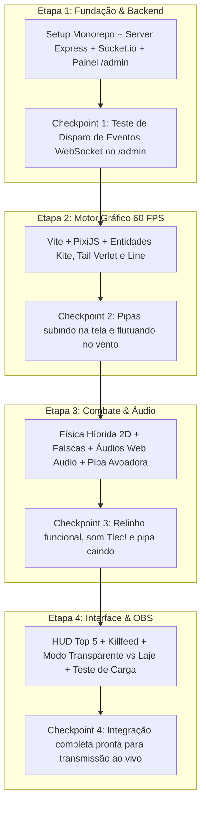

> **ARQUIVADO / HISTÓRICO.** Este documento registra uma etapa anterior e não define a regra vigente. Consulte [`docs/README.md`](../../README.md) e [`00_arquitetura_vigente.md`](../../00_arquitetura_vigente.md).

# 📅 Plano de Implementação: 04. Etapas Sequenciais de Desenvolvimento

Este plano detalha o cronograma executivo, os pré-requisitos técnicos de cada uma das **4 Etapas**, a matriz de arquivos entregues por fase e os critérios rigorosos de conclusão (*Definition of Done*).

---

## 1. Descrição do Objetivo
Estruturar o desenvolvimento em 4 blocos incrementais e independentemente testáveis, permitindo que cada etapa produza uma versão funcional intermediária que pode ser validada no navegador e no painel `/admin` antes de iniciar a etapa subsequente.



---

## 2. Revisão do Usuário Obrigatória (User Review Required)

> [!IMPORTANT]
> **Checkpoints de Validação Intermediária**:
> Ao final de cada etapa, haverá uma parada para validação manual no navegador antes de codificar a próxima. Dessa forma, nenhum bug ou problema de sincronização é acumulado.

> [!NOTE]
> **Garantia de Não-Regressão**:
> Todos os arquivos de configuração de regras e física construídos nas etapas anteriores permanecerão compatíveis com a engine visual do PixiJS.

---

## 3. Matriz de Entregáveis por Etapa

| Etapa | Foco Principal | Arquivos Criados / Modificados | Critério de Conclusão (DoD) |
|---|---|---|---|
| **Etapa 1** | Backend & Admin | `package.json`<br>`backend/server.js`<br>`backend/tiktokService.js`<br>`backend/views/admin.html`<br>`backend/rules/*` | Servidor roda na porta 3000, rota `/admin` dispara eventos WebSocket validados no log |
| **Etapa 2** | Render PixiJS | `frontend/vite.config.js`<br>`frontend/index.html`<br>`frontend/src/main.js`<br>`frontend/src/engine/App.js`<br>`frontend/src/entities/Kite.js`<br>`frontend/src/entities/Tail.js`<br>`frontend/src/entities/Line.js` | Botão "Spawn Pipa" no `/admin` faz surgir pipa com avatar e rabiola na tela a 60 FPS |
| **Etapa 3** | Relinho & Áudio | `frontend/src/engine/Physics.js`<br>`frontend/src/engine/AudioManager.js`<br>`frontend/src/entities/SparkEmitter.js`<br>`frontend/src/entities/FallingKite.js` | Duas pipas cruzando linhas emitem faíscas, som "Tlec!" e a perdedora desce rodopiando |
| **Etapa 4** | HUD & OBS | `frontend/src/ui/HUD.js`<br>`frontend/src/ui/SkyScene.js`<br>`frontend/src/managers/KiteStatusManager.js` | Placar Top 5 animado, killfeed na tela, suporte a fundo transparente no OBS e teste com 30+ pipas |

---

## 4. Detalhamento e Sequência de Tarefas

### 🔹 ETAPA 1: Infraestrutura Monorepo, Backend e Painel Admin
1. **Tarefa 1.1**: Criar `package.json` raiz com dependências (`express`, `socket.io`, `tiktok-live-connector`, `cors`, `vite`, `pixi.js`, `howler`) e scripts integrados (`npm run dev`).
2. **Tarefa 1.2**: Implementar `backend/server.js` com rotas `/` e `/admin` e instanciar o hub Socket.io.
3. **Tarefa 1.3**: Criar `backend/tiktokService.js` com suporte a modo online (Live TikTok) e modo offline resiliente.
4. **Tarefa 1.4**: Criar `backend/views/admin.html` com layout escuro e botões para simular comentários, likes, presentes (Rosa, Donut, Capivara, Perfume, Leão) e spawn de bots.
5. **Tarefa 1.5**: Criar `backend/rules/giftConfig.js`, `gameRules.js` e `buffManager.js`.

### 🔹 ETAPA 2: Motor Visual PixiJS & Renderização de Pipas
1. **Tarefa 2.1**: Configurar `frontend/vite.config.js` e `frontend/index.html`.
2. **Tarefa 2.2**: Inicializar o canvas PixiJS 60 FPS em `frontend/src/engine/App.js` com viewport 9:16 ou 16:9.
3. **Tarefa 2.3**: Criar `frontend/src/entities/Kite.js` com máscara circular para a foto de perfil do espectador e oscilação de vento.
4. **Tarefa 2.4**: Criar `frontend/src/entities/Tail.js` com física de nós (Verlet Integration) para rabiola fluida.
5. **Tarefa 2.5**: Criar `frontend/src/entities/Line.js` para renderizar a linha desde o rodapé da laje até a pipa.

### 🔹 ETAPA 3: Física Híbrida de Relinho & Efeitos Sonoros
1. **Tarefa 3.1**: Implementar `frontend/src/engine/Physics.js` com cálculo de proximidade por raio + interseção geométrica 2D de retas.
2. **Tarefa 3.2**: Implementar `frontend/src/entities/SparkEmitter.js` com partículas PixiJS no ponto exato $(X, Y)$ da colisão.
3. **Tarefa 3.3**: Implementar `frontend/src/engine/AudioManager.js` com estalo "Tlec!" sintetizado via Web Audio API e som ambiente de vento.
4. **Tarefa 3.4**: Implementar `frontend/src/entities/FallingKite.js` para a física de descida da Pipa Avoadora e captura por `#pegar`.

### 🔹 ETAPA 4: HUD de Live, OBS Studio & Polimento Final
1. **Tarefa 4.1**: Criar `frontend/src/ui/HUD.js` contendo o Placar Top 5 Cortadores, contador de pipas ativas e Killfeed de notificações.
2. **Tarefa 4.2**: Criar `frontend/src/ui/SkyScene.js` com botão/atalho para alternar entre Fundo Transparente e Cenário de Laje com favela e céu dinâmico.
3. **Tarefa 4.3**: Integrar `frontend/src/managers/KiteStatusManager.js` para gerenciar a coroa do "Rei da Laje".
4. **Tarefa 4.4**: Teste de estresse disparando 40 pipas simultâneas via `/admin` e verificando estabilidade a 60 FPS.

---

## 5. Plano de Verificação

### Testes Automatizados
- Scripts de validação de importação e integridade dos módulos:
  ```powershell
  npm run dev
  ```

### Verificação Manual
1. **Etapa 1**: Acessar `http://localhost:3000/admin`, clicar em "Spawn Bot" e confirmar o evento emitido no log.
2. **Etapa 2**: Acessar `http://localhost:3000`, verificar renderização do canvas e surgimento das pipas com avatar e rabiola.
3. **Etapa 3**: Fazer 2 pipas colidirem, verificar surgimento de faíscas no ponto de cruzamento e som de corte.
4. **Etapa 4**: Abrir no OBS Studio como Browser Source transparente e validar overlay sobre a transmissão.
