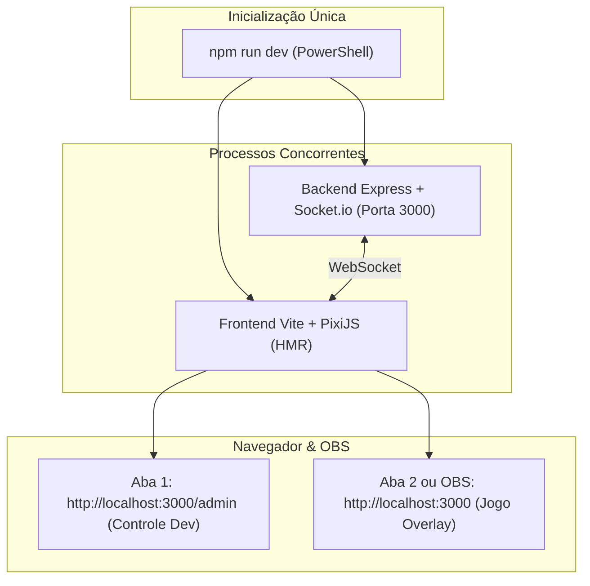

# 🛠️ Plano de Implementação: 05. Plano de Desenvolvimento Prático

Este plano detalha o workflow prático de execução, os scripts do PowerShell, a ordem de codificação arquivo por arquivo, a estratégia de desenvolvimento offline e o guia de integração com o OBS Studio.

---

## 1. Descrição do Objetivo
Definir o guia prático passo a passo de desenvolvimento (*hands-on*), padronizando a execução do projeto no Windows/PowerShell através de um único comando `npm run dev`, permitindo que o desenvolvedor codifique e valide alterações em tempo real com Hot Module Replacement (HMR) e feedback instantâneo no painel `/admin`.



---

## 2. Revisão do Usuário Obrigatória (User Review Required)

> [!IMPORTANT]
> **Execução Unificada com Concurrently**:
> Para não precisar abrir dois terminais PowerShell separados (um para backend e outro para frontend), o projeto usará a biblioteca `concurrently`. Um único comando `npm run dev` gerencia e monitora os dois processos simultaneamente.

> [!NOTE]
> **Fluxo de Trabalho de Teste em Duas Telas**:
> - **Tela do Jogo**: `http://localhost:3000/` (renderiza o canvas PixiJS para o OBS Studio).
> - **Tela de Controle**: `http://localhost:3000/admin` (painel escuro com botões para simular comentários, presentes e bots).
> Todas as ações disparadas no `/admin` são refletidas instantaneamente na tela do jogo via Socket.io.

---

## 3. Ordem Sequencial de Escrita de Código e Arquivos

### 🚀 Bloco 1: Fundação do Monorepo e Dependências
1. Criar `package.json` com scripts integrados:
   ```json
   {
     "name": "rei-da-laje",
     "version": "1.0.0",
     "scripts": {
       "dev": "concurrently \"node backend/server.js\" \"vite frontend\"",
       "build": "vite build frontend",
       "start": "node backend/server.js"
     }
   }
   ```
2. Instalar dependências de produção: `express`, `socket.io`, `tiktok-live-connector`, `cors`, `concurrently`.
3. Instalar dependências de desenvolvimento: `vite`, `pixi.js`, `howler`.

---

### 🚀 Bloco 2: Core do Backend e Painel Admin
1. `backend/server.js`:
   - Configurar servidor HTTP + Socket.io na porta `3000`.
   - Servir rota estática `/admin` apontando para `backend/views/admin.html`.
2. `backend/rules/giftConfig.js`:
   - Dicionário de presentes e multiplicadores de poder.
3. `backend/rules/buffManager.js`:
   - Controle de temporizadores e upgrades de cerol.
4. `backend/tiktokService.js`:
   - Conector TikTok Live com suporte automático a modo simulação offline.
5. `backend/views/admin.html`:
   - Interface visual com botões rápidos: `+ Spawn Bot`, `🌹 Rosa`, `🍩 Donut`, `🦫 Capivara`, `⚡ Puxar`, `🛡️ Descarregar`.

---

### 🚀 Bloco 3: Engine Visual PixiJS e Entidades
1. `frontend/vite.config.js` e `frontend/index.html`:
   - Configuração de viewport 9:16 e fundo transparente.
2. `frontend/src/main.js`:
   - Conexão do cliente Socket.io e inicialização do loop PixiJS.
3. `frontend/src/engine/App.js`:
   - Inicialização do canvas PixiJS a 60 FPS com redimensionamento responsivo.
4. `frontend/src/entities/Kite.js`:
   - Sprite da pipa, máscara circular para foto de perfil do usuário e oscilação de vento.
5. `frontend/src/entities/Tail.js`:
   - Física de nós (Verlet Integration) para rabiola dinâmica.
6. `frontend/src/entities/Line.js`:
   - Traçado de linha colorida conectando a laje à pipa.

---

### 🚀 Bloco 4: Física de Relinho, Combate e Áudio
1. `frontend/src/engine/Physics.js`:
   - Interseção geométrica de vetores 2D e cálculo de tensão de combate.
2. `frontend/src/engine/AudioManager.js`:
   - Sintetizador procedural do som "Tlec!" (estouro de linha) e som ambiente de vento via Web Audio API.
3. `frontend/src/entities/SparkEmitter.js`:
   - Sistema de partículas incandescentes no ponto $(X_{\text{cruz}}, Y_{\text{cruz}})$.
4. `frontend/src/entities/FallingKite.js`:
   - Animação de queda suave da Pipa Avoadora e resgate por `#pegar`.

---

### 🚀 Bloco 5: Interface do OBS e Polimento Final
1. `frontend/src/ui/HUD.js`:
   - Placar Top 5 Cortadores, contador de pipas ativas e Killfeed de notificações.
2. `frontend/src/ui/SkyScene.js`:
   - Alternador de fundo (Modo Overlay Transparente vs Cenário de Favela/Laje).
3. Testes finais de estresse com 40+ pipas simultâneas.

---

## 4. Guia de Configuração no OBS Studio

Para transmitir o jogo com transparência sobre a sua câmera ou cenário:
1. No OBS Studio, adicione uma nova fonte: **Navegador (Browser Source)**.
2. Configure as seguintes propriedades:
   - **URL**: `http://localhost:3000`
   - **Largura (Width)**: `1080`
   - **Altura (Height)**: `1920` (ou `1920x1080` se sua live for horizontal)
   - **FPS**: `60`
   - **Desativar quando não estiver visível (Shutdown source when not visible)**: `Desmarcado` (falso)
   - **Atualizar o navegador quando a cena se tornar ativa**: `Marcado` (verdadeiro)
3. Posicione o jogo como a camada mais alta para que as pipas voem sobre o seu vídeo.

---

## 5. Plano de Verificação

### Testes Automatizados / Scripts
- Validar inicialização concorrente sem travamentos:
  ```powershell
  npm run dev
  ```
- Validar se o build de produção é gerado com sucesso:
  ```powershell
  npm run build
  ```

### Verificação Manual
1. Iniciar o projeto com `npm run dev`.
2. Abrir `http://localhost:3000/admin` e `http://localhost:3000` lado a lado.
3. No `/admin`, clicar em "Spawn Bot": a pipa deve surgir na outra janela imediatamente.
4. Clicar em "Rosa (Cerol)": a linha deve ficar vermelha na outra janela.
5. Inserir a URL no OBS Studio como Browser Source e confirmar que o fundo fica transparente e as pipas renderizam com 60 FPS fluidos.
