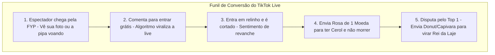

# 🔍 Plano Estratégico: 06. Pesquisa de Mercado, Benchmarking e Monetização

Este plano detalha o benchmarking com os maiores concorrentes do setor (**TikLive Games, Kyrat Games, TikFinity**), as estratégias comprovadas de monetização via presentes do TikTok, os gatilhos psicológicos de retenção da audiência e as práticas para evitar punições ou *shadowban* pelo algoritmo da plataforma.

---

## 1. Descrição do Objetivo
Consolidar a estratégia comercial e de engajamento do jogo com base no que já gera milhares de visualizações simultâneas e alta receita nas lives brasileiras de pipa, garantindo que o produto final seja superior às ferramentas pagas existentes no mercado.

---

## 2. Revisão do Usuário Obrigatória (User Review Required)

> [!IMPORTANT]
> **Conformidade com as Diretrizes do TikTok Live (Anti-Shadowban)**:
> - O TikTok penaliza transmissões 100% estáticas ou abandonadas ("Lives Fantasmas").
> - **Recomendação**: O jogo deve permitir que a câmera do streamer (ou voz ativa no microfone) apareça junto à tela através do **Modo Transparente**, com interações constantes do streamer narrando os cortes como locutor.
> - O jogo não deve prometer retorno financeiro em dinheiro real para os espectadores (apenas vantagens dentro do jogo como cerol e ranking), respeitando os termos de uso de presentes do TikTok.

> [!NOTE]
> **Estratégia de Precificação dos Presentes**:
> 85% do faturamento de lives interativas de combate vem de **pequenos presentes em grande volume** (especialmente a **Rosa de 1 moeda**). O jogo foi desenhado para que a Rosa dê uma vantagem muito perceptível (Cerol Fino 1.5x), incentivando espectadores a enviarem dezenas de rosas a cada partida.

---

## 3. Análise Competitiva de Mercado (Benchmarking)

| Plataforma / Concorrente | Modelo de Negócio | Pontos Fortes | Limitações do Concorrente | Nossa Vantagem Competitiva |
|---|---|---|---|---|
| **TikLive Games ("Pipa Combate Live")** | Mensalidade paga (R$ 80 a R$ 150/mês) | Fácil de usar, já vem configurado | Código fechado, dependência de terceiros, taxa mensal recorrente | **100% Proprietário e Gratuito**, sem mensalidades e totalmente customizável |
| **Kyrat Games** | Venda de licença/launcher | Variedade de mini-jogos genéricos | Gráficos simples, sem física realista de linha e sem física Verlet de rabiola | **Física Híbrida 2D real** com cruzamento vetorial e rabiolas animadas fluidas |
| **TikFinity** | Freemium | Muito estável para alertas e sons | Focado em overlays genéricos, não possui engine de combate de pipas | **Experiência Temática Completa**: Favela, Laje, Cerol, Linha Chile e Pipa Avoadora |

---

## 4. Pilares de Retenção e Viralização Algorítmica

### 🧠 Gatilho 1: O "Efeito Narciso / Avatar no Céu"
- Ver a própria foto de perfil do TikTok recortada no centro de uma pipa flutuando em 60 FPS prende a atenção do usuário instantaneamente.
- Ele chama amigos e seguidores para assistir e torcer pela sua pipa.

### 🔁 Gatilho 2: O Loop de Comentários Constantes
- Quando a pipa é cortada ("Tlec!"), ela cai como **Pipa Avoadora**.
- O locutor avisa: *"Pipa do @Usuario cortada! Digite #pegar para resgatar!"*.
- Enquanto vários espectadores digitam `#pegar`, o dono da pipa eliminada precisa comentar novamente para renascer.
- Esse pico de 10 a 30 comentários por minuto sinaliza alta relevância para a IA do TikTok, jogando a transmissão para a aba "Para Você" (FYP) de novos usuários.

### 👑 Gatilho 3: A Batalha pelo "Rei da Laje" (Status e Prestígio)
- A coroa dourada animada sobre a pipa do jogador que lidera o ranking cria disputa de ego entre os espectadores mais fiéis e doadores.
- Para desbancar o Rei da Laje, outros espectadores enviam presentes mais caros (Donut, Capivara, Perfume).

---

## 5. Plano de Ação para Implementação das Melhores Práticas

### Diretrizes de Código a Incorporar no Projeto
1. **Suporte Nativo a Webcams Transparentes**: Manter o `SkyScene.js` com transparência total por padrão para permitir a câmera do streamer narrando os cortes.
2. **Sistema de Locução / Áudio de Meme**: Integrar o `AudioManager.js` com efeitos sonoros clássicos de relinho para manter o ritmo animado.
3. **Placar Top 5 com Avatares em Destaque**: Mostrar o pódio com fotos reais dos espectadores para incentivar a competição contínua.

---

## 6. Plano de Verificação

### Verificação de Diretrizes
- Testar a taxa de atualização e envio de eventos para evitar gargalos ou sobrecarga na conexão com o TikTok Live.
- Simular 20 comentários rápidos por segundo no `/admin` e checar se o WebSocket processa todas as entradas sem lag ou perda de frames.
